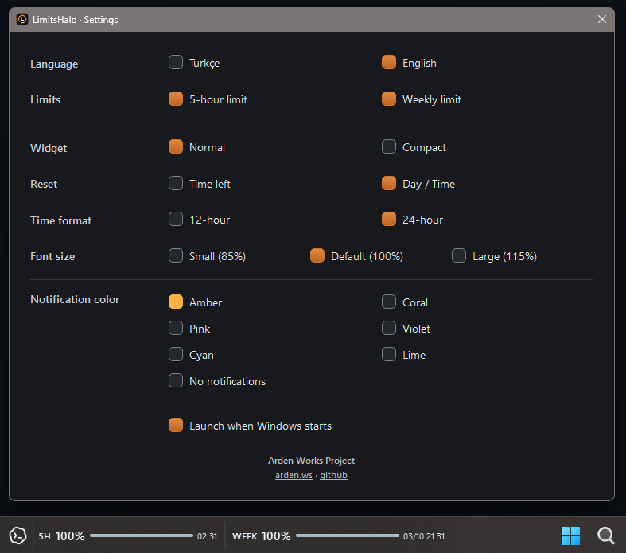
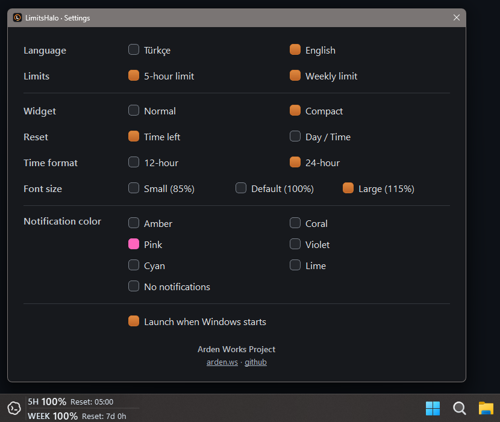

# LimitsHalo

[English](README.md) / [Türkçe](README.tr.md)

**Codex kullanım limitlerini doğrudan Windows görev çubuğunda gör.**

LimitsHalo, kalan **5 saatlik ve haftalık Codex limitlerini** görev çubuğunda gösterir. Limitlerini görmek için Codex'i açmana veya kullanımını ayrıca kontrol etmene gerek kalmaz.

Mevcut Codex Desktop oturumunu yerel olarak kullanır. **API anahtarı gerekmez.**

## Ekran görüntüleri





## İndir

En güncel Windows kurulum dosyasını [GitHub Releases](https://github.com/arden-works/limits-halo/releases) sayfasından indirin.

> Kurulum dosyası şu anda dijital olarak imzalanmamıştır; Windows SmartScreen uyarı gösterebilir.

## Kullanım

- Kalan 5 saatlik ve haftalık limitlerin doğrudan Windows görev çubuğunda görünür.
- Codex simgesine tıklayarak Codex'i açabilir, öne getirebilir veya simge durumuna küçültebilirsin.
- Bildirim alanı menüsünden **Ayarlar**'a, kullanım verisini yenilemeye, başlangıçta çalıştırma seçeneğine ve LimitsHalo'dan çıkışa erişebilirsin.
- Ayarların bilgisayarında yerel olarak tutulur.

## Gereksinimler

- Windows 11 (doğrulandı); Windows 10 henüz doğrulanmadı
- Codex Desktop kurulu ve oturum açılmış olmalı

## Kaynak koddan çalıştırma

Python 3.10 veya daha yeni bir sürüm gereklidir.

```powershell
python -m venv .venv
.\.venv\Scripts\python.exe -m pip install -r requirements.txt
.\.venv\Scripts\python.exe main.py
```

İlk çalıştırmada `config.example.json`, dosya henüz yoksa yerel ve Git tarafından yok sayılan `config.json` dosyasına kopyalanır. Widget'ı kapatmak için `main.py --quit` komutunu çalıştırın. Geliştirme amaçlı `--mock` ve `--test` seçenekleri örnek verileri belirgin biçimde işaretler; `--test` ayrıca sağ tıklamayla örnek yüzdeler arasında geçiş yapmanızı sağlar.

## Bilinen sınırlamalar

- Şu anda birincil yatay Windows görev çubuğunu hedefler.
- Windows 10 ve çoklu monitör davranışı henüz tam olarak doğrulanmadı.
- LimitsHalo yalnızca Codex'in sağladığı limitleri gösterir; eksik kullanım verisini tahmin etmez.
- Bildirim animasyonu Windows'un yerel bildirim verilerine bağlıdır.

## Lisans

LimitsHalo kaynak kodu [Apache License 2.0](LICENSE) kapsamında lisanslanmıştır. Copyright (c) 2026 Arden Works; bkz. [NOTICE](NOTICE).

Üçüncü taraf bileşenler ve ticari markalar için [THIRD_PARTY_NOTICES.md](THIRD_PARTY_NOTICES.md) dosyasına bakın.

LimitsHalo bağımsız bir projedir; OpenAI ile bağlantılı değildir ve OpenAI tarafından desteklenmemektedir.
